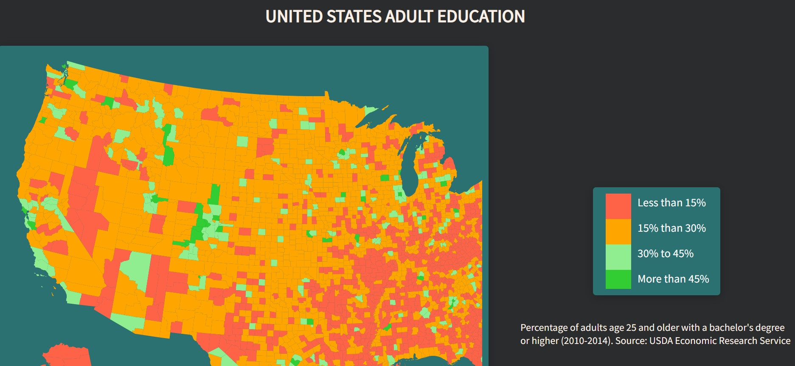

FCC - Data Visualization Projects - Visualize Data with a Choropleth Map

[Live Demo](https://aneal07.github.io/Choropleth-Map/)

User Stories:
Title: My choropleth should have a title with a corresponding id="title".
Description: My choropleth should have a description element with a corresponding id="description".
Counties: My choropleth should have counties with a corresponding class="county" that represents the data.
Fill Colours: There should be at least 4 different fill colours used for the counties.
County Data: My counties should each have data-fips and data-education properties containing their corresponding fips and education values.
County Completeness: My choropleth should have a county for each provided data point.
Matching Data: The counties should have data-fips and data-education values that match the sample data.
Legend: My choropleth should have a legend with a corresponding id="legend".
Legend Colours: There should be at least 4 different fill colours used for the legend.
Tooltip Interaction: I can mouse over an area and see a tooltip with a corresponding id="tooltip" which displays more information about the area.
Tooltip Data: My tooltip should have a data-education property that corresponds to the data-education of the active area.
